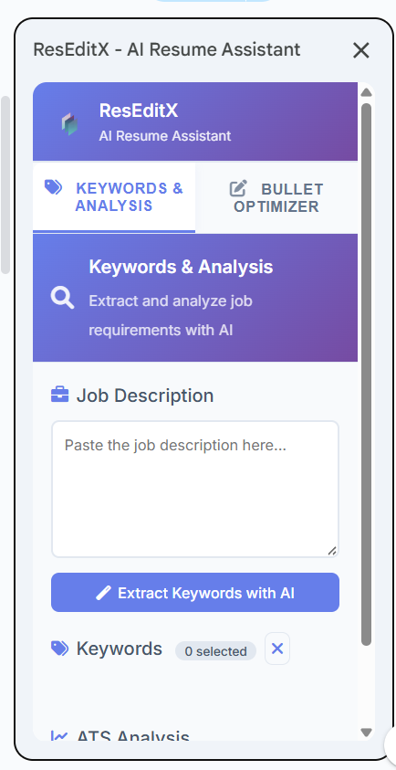
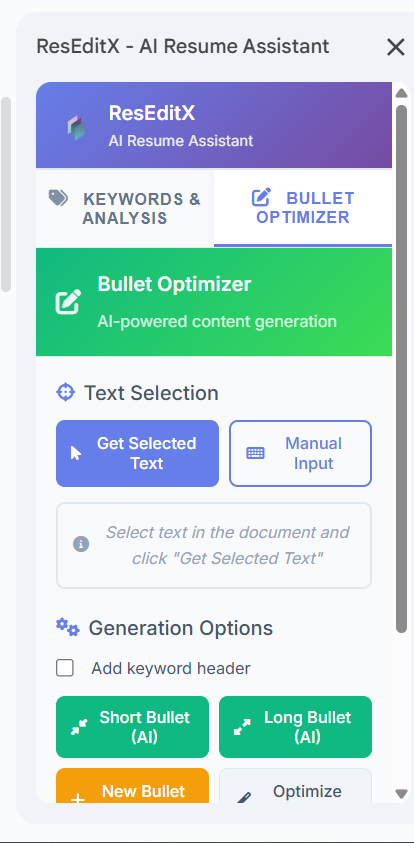
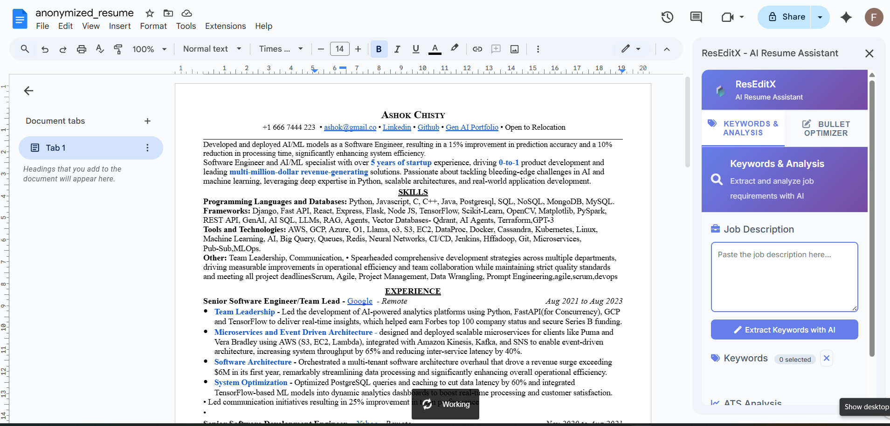
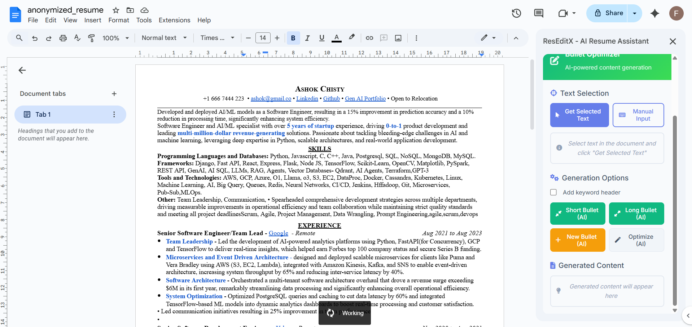

# ResEditX: AI-Powered Resume Optimizer

ResEditX is a smart Google Docs add-on built to supercharge resume editing with Gemini AI. It seamlessly connects a custom Node.js/MongoDB backend for JWT auth and credit tracking. It instantly extracts text, generates ATS scores, and optimizes bullet points on the fly right inside your document. Perfect for an AI-driven writing workflow!

---

## 📸 Demo & Interface

| Sidebar View | Optimization Flow | ATS Scoring | Output Demo |
|:---:|:---:|:---:|:---:|
|  |  |  |  |

---

## 🚀 Key Features
- **Intelligent ATS Scoring:** Analyze your resume text against any job description to get a compatibility score and missing keywords.
- **Smart Bullet Point Generator:** Rewrite mundane bullet points into impactful, action-driven statements using Google's Gemini AI.
- **Seamless Document Integration:** Extract highlighted text and insert AI-generated suggestions directly into your Google Doc with a single click.
- **Secure Backend Authentication:** A custom Node.js backend utilizing JWTs to handle secure logins, user registration, and credit tracking for premium queries.

---

## 📂 Project Structure

```text
GAddOn/
├── addon/                      # Google Apps Script (Frontend & Add-on Logic)
│   ├── Code.gs                 # Core Add-on functions (Gemini API, Document edits)
│   ├── Interface.html          # Sidebar UI (HTML/CSS/JS)
│   ├── test-interface.html     # Standalone AI testing interface
│   ├── appsscript.json         # Add-on Manifest with OAuth scopes
│   ├── GEMINI_INTEGRATION.md   # Documentation on Gemini AI integrations
│   └── RPT/                    # Assets, Privacy, and Terms
│       ├── image.png, image-1.png, image-2.png, image-3.png
│       ├── PRIVACY.md
│       └── TERMS.md
├── backend/                    # Node.js Express Server (Auth & DB)
│   ├── server.js               # Express Server Initialization
│   ├── database/               # MongoDB Connection logic
│   ├── models/                 # Mongoose Schemas (User schema)
│   ├── controllers/            # Auth and Credit updating logic
│   ├── middlewares/            # JWT & Subscription verification
│   ├── routes/                 # API Endpoints
│   └── public/                 # Hosted authentication interface (auth.html)
└── AUTH_INTEGRATION_GUIDE.md   # Documentation for the security flow
```

---

## 🛠️ Quick Start

### 1. Backend Setup
Navigate to the `backend/` directory, install dependencies, and start the server:
```bash
cd backend
npm install
npm run start
```
*Note: Ensure your `.env` contains `MONGO_URI`, `JWT_SECRET_TOKEN`, and `SALTROUNDS`.*

### 2. Add-on Deployment
1. Create a new Google Doc.
2. Open **Extensions > Apps Script**.
3. Copy the contents of `addon/Code.gs` and `addon/Interface.html` into the script editor.
4. Add your Gemini API key inside the script or via the configuration menu.
5. Deploy as a Web App to enable external authentication callbacks.

For more detailed deployment instructions, refer to `addon/SETUP_GUIDE.md` and `addon/QUICK_START.md`.

---
*Developed by ABHIMANYU993*
